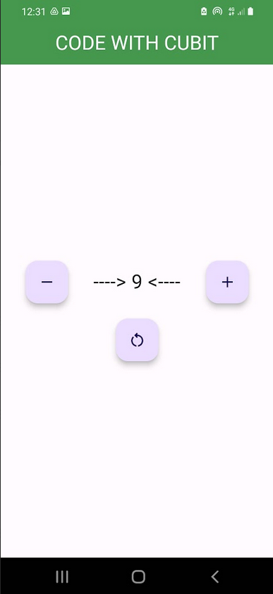

# cubit counter demo

## app-about: ❓

    This application is my first implementation of State Management using Cubit . 
    Following along but slightly customizing my version of the app .
    source: https://bloclibrary.dev/#/fluttercountertutorial

## tested-physical-device: 📲

    Samsung Galaxy A40

## main takeaways: 🤓

- [x] Flutter State Management using Cubit

- [x] Practice code

